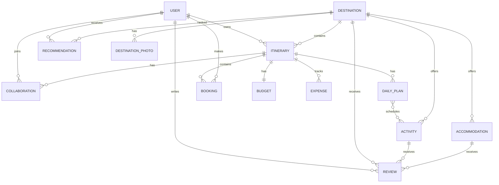

```mermaid
erDiagram
 USER ||--o{ ITINERARY : owns
 USER ||--o{ COLLABORATION : joins
 ITINERARY ||--o{ COLLABORATION : has
 DESTINATION ||--o{ ITINERARY : contains
 ITINERARY ||--o{ DAILY_PLAN : has
 DAILY_PLAN }o--o{ ACTIVITY : schedules
 DESTINATION ||--o{ ACCOMMODATION : offers
 DESTINATION ||--o{ ACTIVITY : offers
 ITINERARY ||--o{ BOOKING : contains
 USER ||--o{ BOOKING : makes
 ITINERARY ||--|| BUDGET : has
 ITINERARY ||--o{ EXPENSE : tracks
 USER ||--o{ REVIEW : writes
 DESTINATION ||--o{ REVIEW : receives
 ACTIVITY ||--o{ REVIEW : receives
 ACCOMMODATION ||--o{ REVIEW : receives
 USER ||--o{ RECOMMENDATION : receives
 DESTINATION ||--o{ RECOMMENDATION : ranked
 DESTINATION ||--o{ DESTINATION_PHOTO : has
```