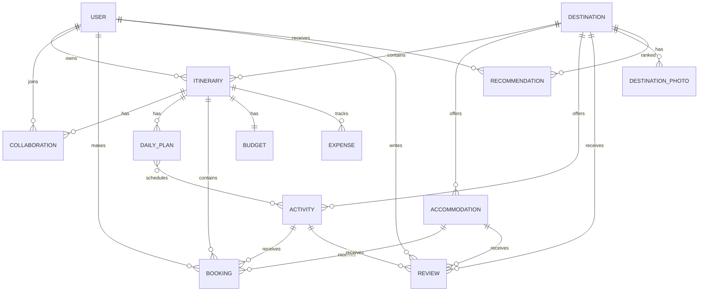

# Travel Planner API — Capstone Plan

## ERD

## Endpoint groups
- Auth: `POST /api/v1/accounts/register/`, `POST /login/`, `GET/PATCH /profile/`, `PATCH /password/change/`, JWT refresh.
- Destinations: catalogue ViewSet, search, preference save.
- Trips: itinerary CRUD, search, report, duplicate, upcoming, collaborators, daily plans.
- Bookings: accommodation/activity CRUD, booking CRUD, confirm/cancel, bulk updates.
- Reviews/Budgets: CRUD plus rating/helpful, budget summary, expense aggregation.
- Analytics: trip totals, budget summary, destination preferences.
- Docs: `/api/docs/`, `/api/redoc/`, `/api/schema/`.

## Authentication flow
`Register/Login -> JWT access + refresh -> Authorization: Bearer <access> -> protected endpoint -> refresh access token when expired.`

## Permission matrix
| Actor | Public catalogue | Owner | Editor | Viewer |
|---|---|---|---|---|
| Anonymous | Read destinations | No | No | No |
| Owner | Yes | Full trip CRUD | N/A | N/A |
| Editor | Yes | N/A | Edit trip content | Read |
| Viewer | Yes | N/A | No | Read |

## URL structure
`/api/v1/<resource>/`; related resources use `/itineraries/<id>/collaborators/` and `/itineraries/<id>/days/`. Router resources provide consistent CRUD routes.

## Testing strategy
- **Accounts:** registration, login, JWT-protected profile, password changes.
- **Models:** validation, relationships, computed properties and business methods.
- **Serializers:** field validation, nested/read-only/write-only behavior.
- **Views:** CRUD status codes, permissions, filters/search, custom actions and reports.
- **Database:** optimized relations with `select_related`, `prefetch_related`, annotations and aggregates.
- **Regression:** run `pytest --cov=.` and require 25+ passing tests and >75% coverage for core code.
